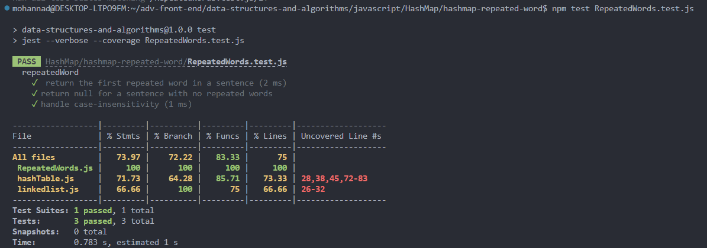

# repeated word using a hash table

### Feature Tasks or problem domain

Write a function called repeated word that finds the first word to occur more than once in a string 

- **Arguments**: string 
- **Return**: string 

### cases

### algorithm

### code

[javaScript file](./RepeatedWords.js)

### tests

### Efficiency

