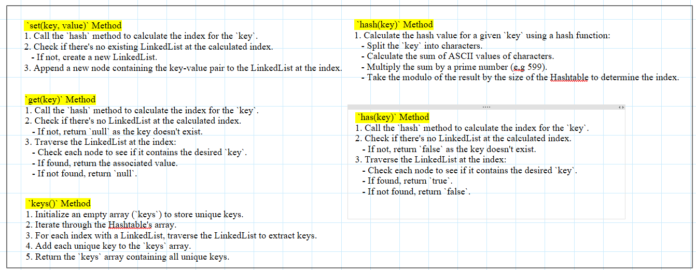
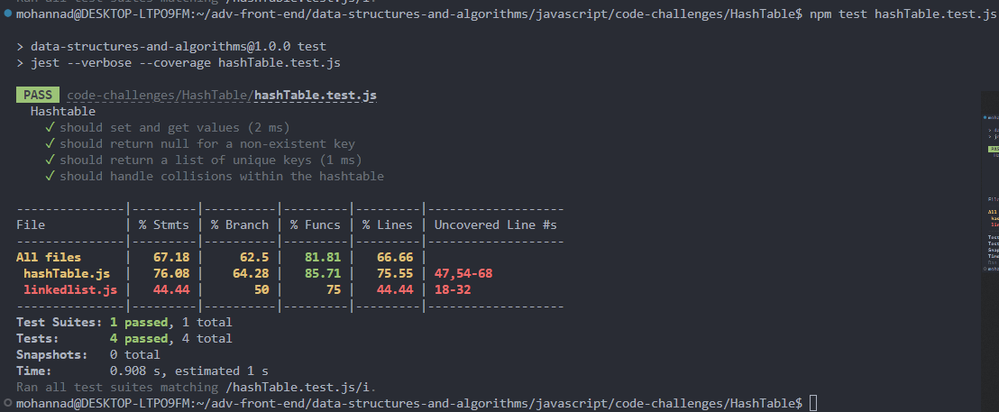
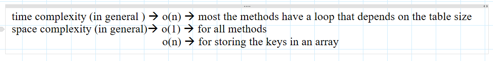

# Hash Table

### Feature Tasks or problem domain

### implementation of hash Table

### Methods

#### `set`

- **Arguments**: `key`, `value`
- **Returns**: nothing
- **Description**: This method hashes the `key` and sets the key and value pair in the table, handling collisions as needed. If a given key already exists, it replaces its value with the `value` argument provided to this method.

#### `get`

- **Arguments**: `key`
- **Returns**: Value associated with that key in the table
- **Description**: This method retrieves the value associated with the specified `key` in the table.

#### `has`

- **Arguments**: `key`
- **Returns**: Boolean
- **Description**: This method checks if the `key` exists in the table and returns `true` if it does, indicating that the key already exists. Otherwise, it returns `false`.

#### `keys`

- **Returns**: Collection of keys
- **Description**: This method returns a collection of all the unique keys that exist in the Hashtable.

#### `hash`

- **Arguments**: `key`
- **Returns**: Index in the collection for that key
- **Description**: This method calculates the index in the collection for the specified `key` using a hashing algorithm.

### algorithm

### code

[javaScript file](./hashTable.js)

### tests

### Efficiency

