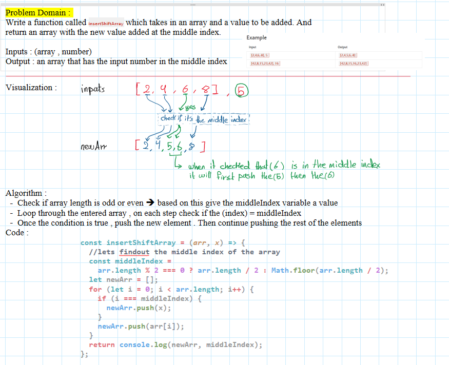

# array-insert-shift

we are given an array and a value to be added. And we must
return an array with the new value added at the middle index.

## Whiteboard Process



## Approach & Efficiency

loop throught the given array , push the elements to the new array
but we must put a condition , if we reach the middle index , we push the added value first . then continue pushing the rest of the elements

## Solution

[javaScript file](./array-insert-shift.js)

```

const insertShiftArray = (arr, x) => {
//lets findout the middle index of the array
const middleIndex =
arr.length % 2 === 0 ? arr.length / 2 : Math.floor(arr.length / 2);

let newArr = [];
for (let i = 0; i < arr.length; i++) {
if (i === middleIndex) {
newArr.push(x);
}
newArr.push(arr[i]);
}

return newArr,;
};

```
