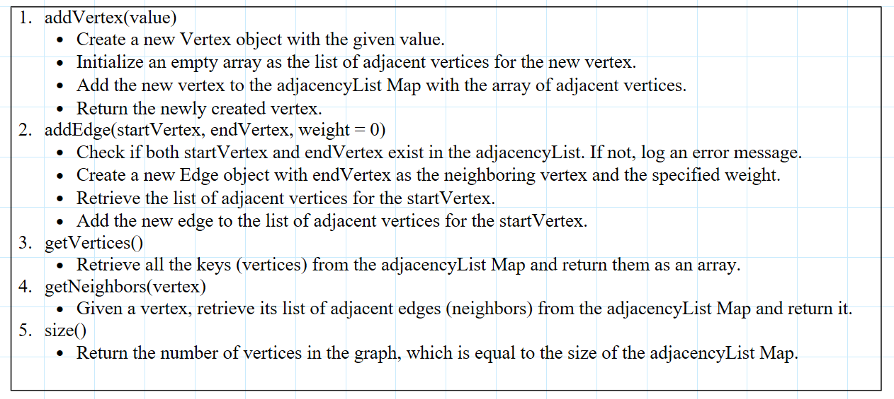
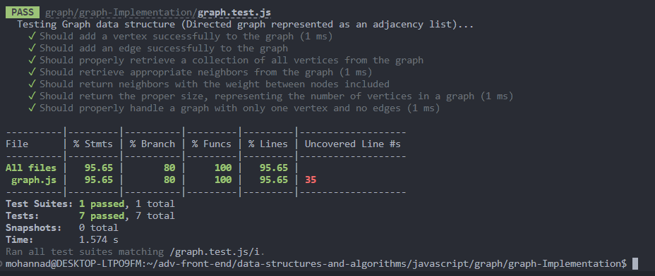
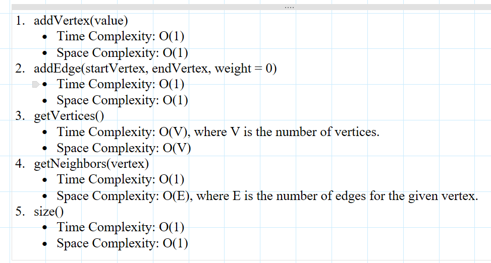

# graph

### Feature Tasks or problem domain

Implement your own Graph. The graph should be represented as an adjacency list, and should include the following methods:  

- **add vertex**

  - **Arguments:** value
  - **Returns:** The added vertex
  - **Description:** Add a vertex to the graph.

- **add edge**

  - **Arguments:** 2 vertices to be connected by the edge, weight (optional)
  - **Returns:** nothing
  - **Description:** Adds a new edge between two vertices in the graph. If specified, assign a weight to the edge. Both vertices should already be in the Graph.

- **get vertices**

  - **Arguments:** none
  - **Returns:** all of the vertices in the graph as a collection (set, list, or similar)
  - **Description:** Returns all of the vertices in the graph. Returns an empty collection if there are no vertices.

- **get neighbors**

  - **Arguments:** vertex
  - **Returns:** a collection of edges connected to the given vertex, including the weight of the connection
  - **Description:** Returns a collection of edges connected to the given vertex, including the weight of the connection. Returns an empty collection if there are no vertices.

- **size**
  - **Arguments:** none
  - **Returns:** the total number of vertices in the graph (0 if there are none)
  - **Description:** Returns the total number of vertices in the graph. Returns 0 if there are no vertices. 
    notes : 
    // Vertex - A vertex, also called a “node”, is a data object that can have zero or more adjacent vertices. 
    // Edge - An edge is a connection between two nodes. 
    // Neighbor - The neighbors of a node are its adjacent nodes, i.e., are connected via an edge. 

### algorithm

### visualization

### code

[javaScript file](./graph.js)

### tests

### Efficiency

