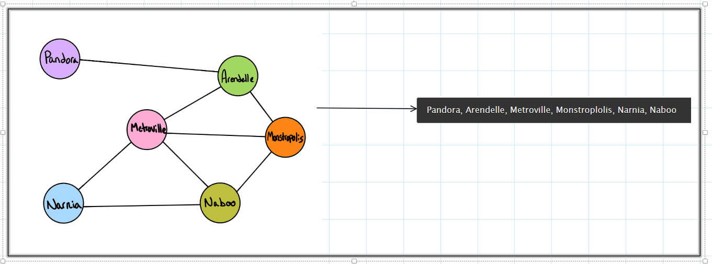
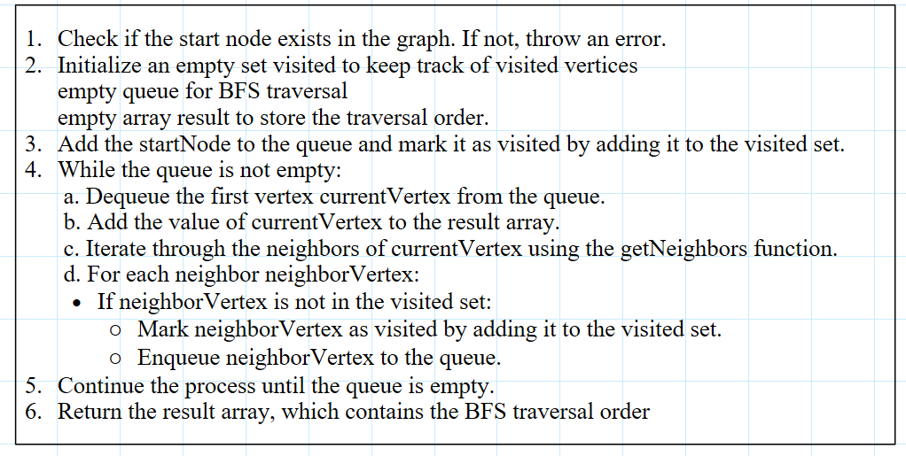
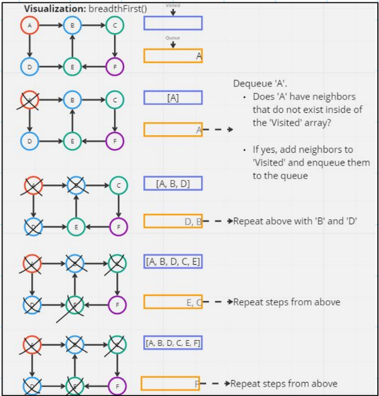
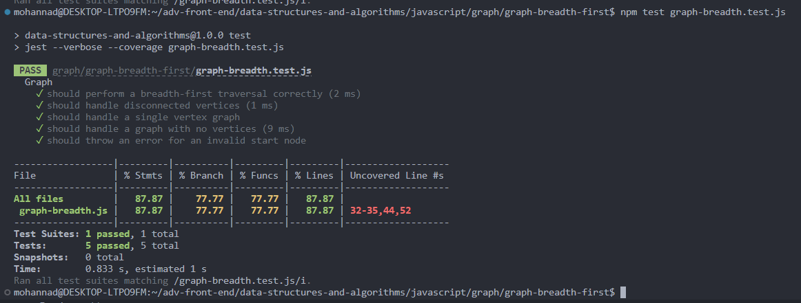
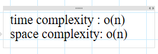

# graph breadth first

### Feature Tasks or problem domain

Write the following method for the Graph class:

- breadth first
- Arguments: Node
- Return: A collection of nodes in the order they were visited.
- Display the collection

### test case

### algorithm

### visualization

### code

[javaScript file](./graph-breadth.js)

### tests

### Efficiency

