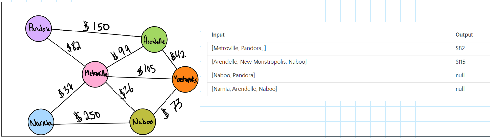
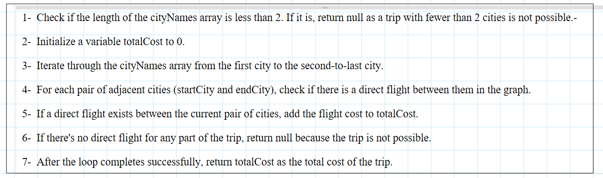
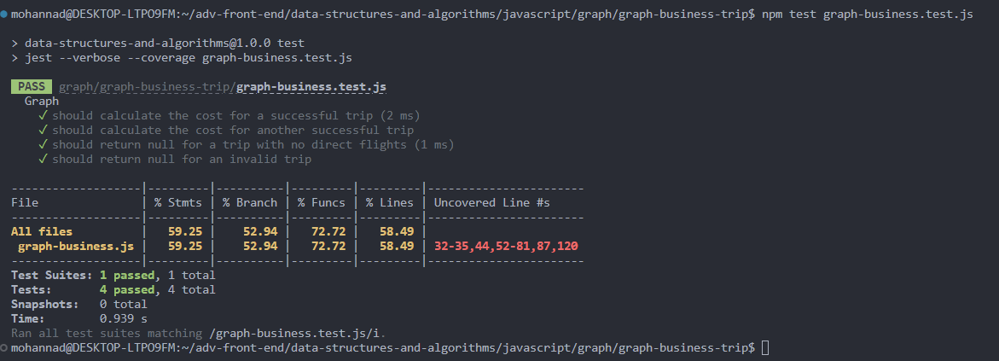
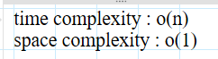

# graph

### Feature Tasks or problem domain

- Write a function called business trip
- Arguments: graph, array of city names
- Return: the cost of the trip (if it’s possible) or null (if not)
- Determine whether the trip is possible with direct flights, and how much it would cost.

### test caase

### algorithm

### visualization

### code

[javaScript file](./graph-business.js)

### tests

### Efficiency

