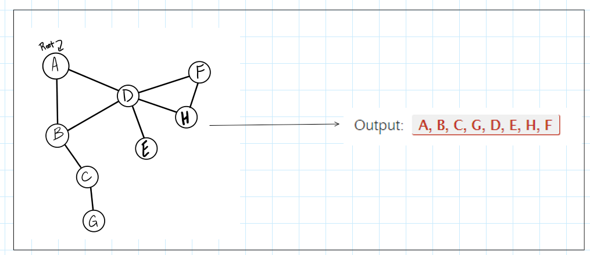

# graph depth first

### Feature Tasks or problem domain

- Write the following method for the Graph class:

- Name: Depth first
- Arguments: Node (Starting point of search)
- Return: A collection of nodes in their pre-order depth-first traversal order
- Program output: Display the collection

### test caase

### algorithm

### code

[javaScript file](./graph-depth-first.js)

### tests

### Efficiency

