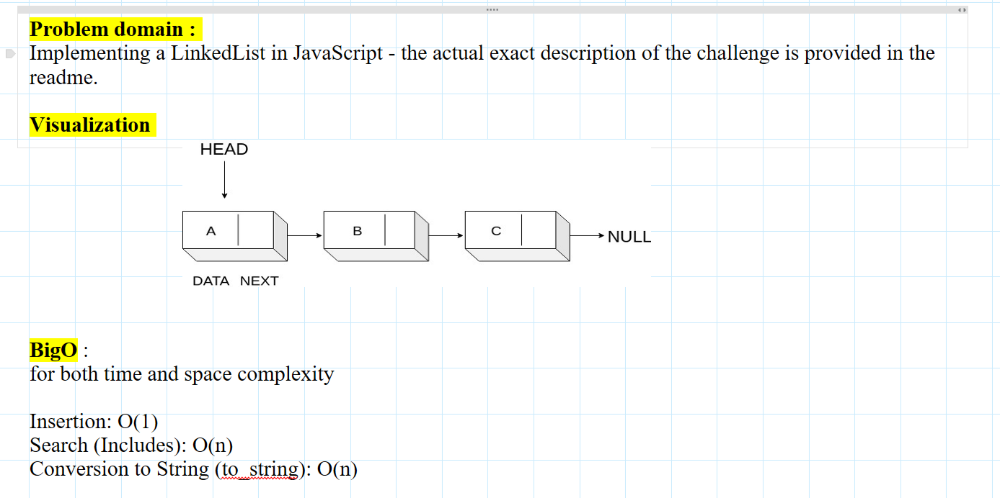
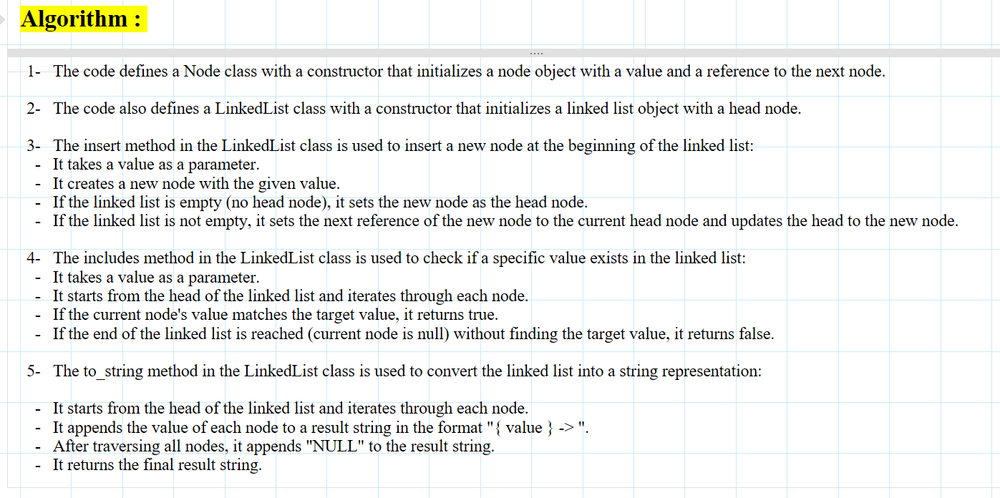

# linked-list

we need to implement a linkedlist in Javascript where

### Node

Create a Node class that has properties for the value stored in the Node, and a pointer to the next Node.

### Linked List

**Create a Linked List class**

1- Within your Linked List class, include a head property.

- Upon instantiation, an empty Linked List should be created.

2- The class should contain the following methods

**insert**

- Arguments: value

- Returns: nothing

- Adds a new node with that value to the head of the list with an O(1) Time performance.

**includes**

- Arguments: value

- Returns: Boolean

- Indicates whether that value exists as a Node’s value somewhere within the list.

**to_string**

- Arguments: none

- Returns: a string representing all the values in the Linked List, formatted as: "{ a } -> { b } -> { c } -> NULL"

## Whiteboard Process




## Approach & Efficiency

loop throught the given array , push the elements to the new array
but we must put a condition , if we reach the middle index , we push the added value first . then continue pushing the rest of the elements

## Solution

[javaScript file](./index.js)

```

"use strict";

class Node {
  constructor(value, next = null) {
    this.value = value;
    this.next = next;
  }
}
/* ================================================= */
module.exports = class LinkedList {
  constructor(head = null) {
    this.head = head;
  }

  insert(value) {
    const new_node = new Node(value);
    if (!this.head) {
      this.head = new_node;
    } else {
      new_node.next = this.head;
      this.head = new_node;
    }
  }

  includes(value) {
    let current = this.head;
    while (current) {
      if (current.value === value) {
        return true;
      } else {
        current = current.next;
      }
    }
    if (current === null) {
      return false;
    }
  }

  to_string() {
    let current = this.head;
    let result = "";
    while (current) {
      result += `{ ${current.value} } -> `;
      current = current.next;
    }
    result += "NULL";
    return result;
  }
};


```
