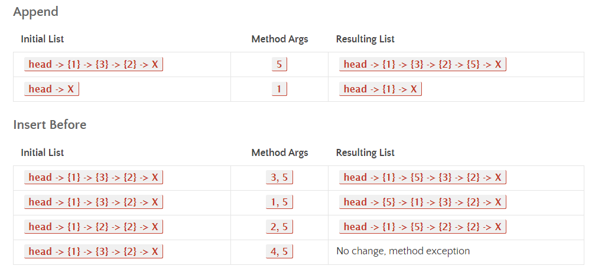
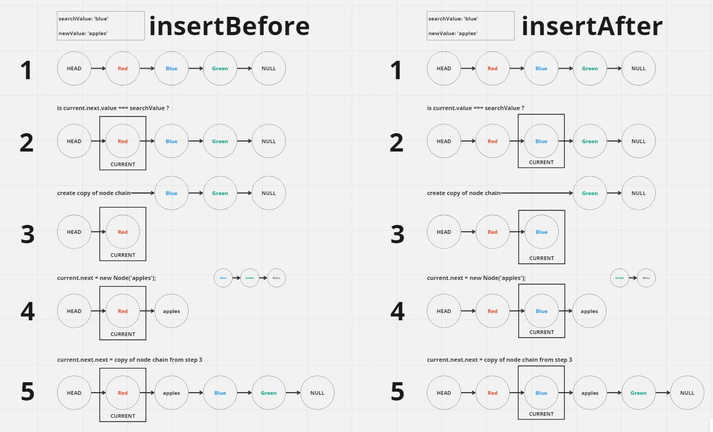

## linked-list-insertions

### Feature Tasks or problem domain

Write the following methods for the Linked List class:

#### append

- arguments: new value
- adds a new node with the given value to the end of the list

#### insert before

-arguments: value, new value
-adds a new node with the given new value immediately before the first node that has the value specified

#### insert after

- arguments: value, new value
- adds a new node with the given new value immediately after the first node that has the value specified

### example test cases

### algorithm

#### the "append" method in the LinkedList class.

- This method takes a new value as a parameter and adds a new node with the value to the end of the linked list.
- Set the "currentNode" variable to the head node.
- Use a while loop to iterate through the linked list. Inside the loop, check if the next node of the current node is null.
- If it is null, create a new node with the new value and assign it as the next node of the current node. Break out of the loop.
- If the next node is not null, update the "currentNode" to the next node.
- Repeat the process until the end of the linked list is reached

#### the "insertBefore" method in the LinkedList class.

- This method takes a search value and a new value as parameters and inserts a new node with the new value before the node with the search value in the linked list.
- Set the "currentNode" variable to the head node. Use a while loop to iterate through the linked list.
- Inside the loop, check if the value of the next node of the current node is equal to the search value.
- If they are equal, create a new node with the new value and insert it before the next node. Break out of the loop.
- If the next node is null, print an error message indicating that the search value was not found.
- If none of the conditions are met, update the "currentNode" to the next node and repeat the process.

#### the "insertAfter" method in the LinkedList class.

- This method takes a search value and a new value as parameters and inserts a new node with the new value after the node with the search value in the linked list.
- Set the "currentNode" variable to the head node. Use a while loop to iterate through the linked list.
- Inside the loop, check if the value of the current node is equal to the search value.
- If they are equal, create a new node with the new value and insert it after the current node. Break out of the loop.
- If the next node is null, print an error message indicating that the end of the list has been reached.
- If none of the conditions are met, update the "currentNode" to the next node and repeat the process.

### visualization

### code

[javaScript file](./index.js)

### Efficiency

for the three new methods :
- time complexity : o(n)
- space complexity : o(1)
