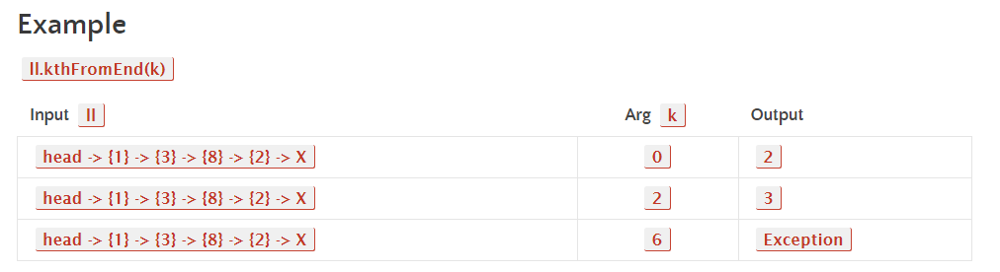
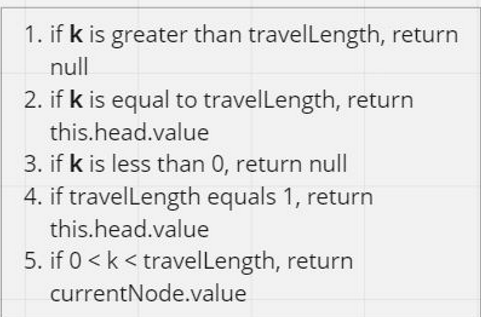
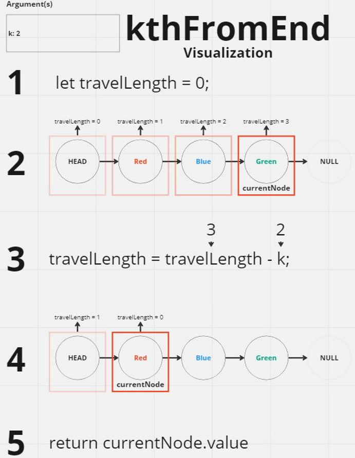
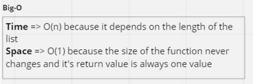

## linked-list-Kth

### Feature Tasks or problem domain

Write the following method for the Linked List class:

#### kth from end

- argument: a number, k, as a parameter.
- Return the node’s value that is k places from the tail of the linked list.
- You have access to the Node class and all the properties on the Linked List class as well as the methods created in previous challenges.

### example test cases

### algorithm

#### Implement the "kthFromEnd" method in the LinkedList class.

- It takes a parameter "k" representing the position from the end of the list.
- Set "travelLength" to 0 and "currentNode" to the head node.
- Use a while loop to iterate through the linked list, incrementing "travelLength" as long as the next node is not null.
- Once the loop is finished, check if "travelLength" is less than "k" or "k" is negative. If it is, return null.
- Update "travelLength" by subtracting "k" and Set "currentNode" back to the head node.
- Use another while loop to iterate through the linked list -"travelLength" times-, moving "currentNode" to reach the kth node from the end.
- Finally, return the value of the kth node.

### visualization

### code

[javaScript file](./index.js)

### Efficiency

