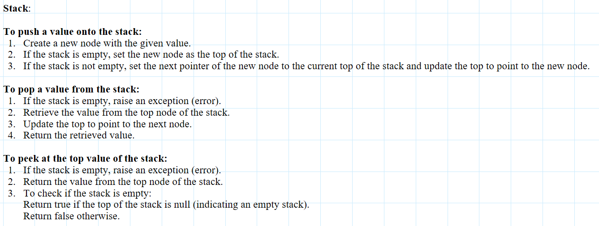
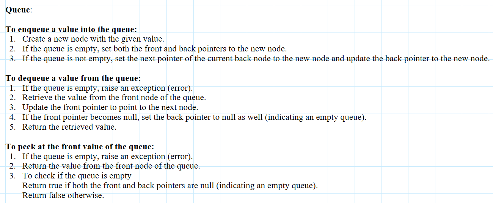
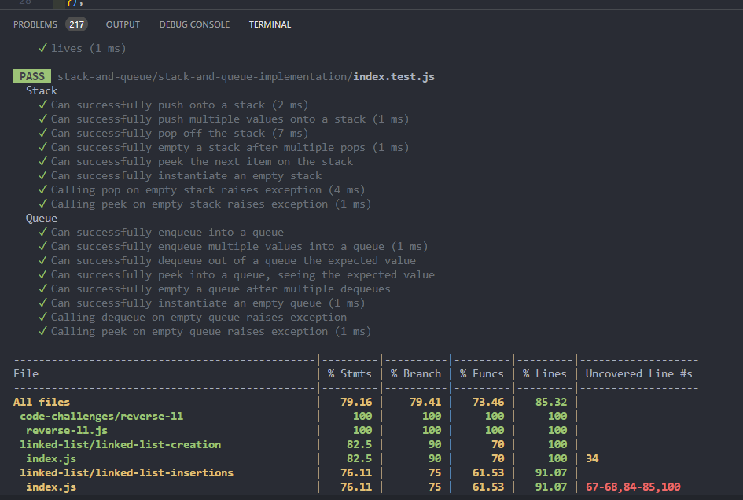
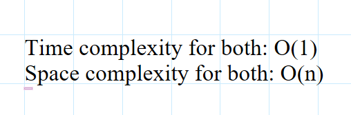

## satck and Queues

### Feature Tasks or problem domain

#### Using a Linked List as the underlying data storage mechanism, implement both a Stack and a Queue

important methods to be implemented are pop , push , enqueue , dequeue , peek

### algorithm

### visualization

### code

[javaScript file](./index.js)

### tests

### Efficiency

