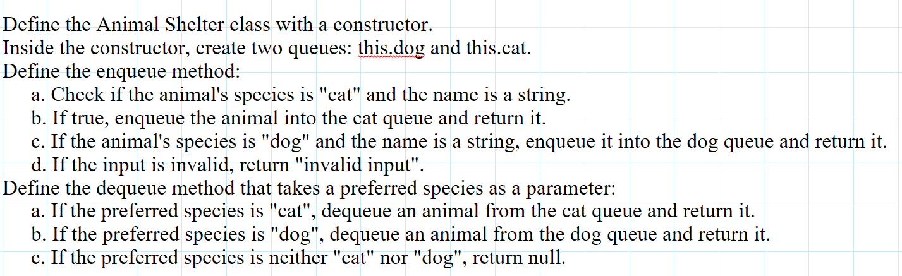

## satck and Queues

### Feature Tasks or problem domain

#### First-in, First out Animal Shelter. using queue

- Create a class called AnimalShelter which holds only dogs and cats.
- The shelter operates using a first-in, first-out approach.
- Implement the following methods:
  - enqueue
    - Arguments: animal
      - animal can be either a dog or a cat object.
      - It must have a species property that is either "cat" or "dog"
      - It must have a name property that is a string.
        dequeue
    * Arguments: pref
      - pref can be either "dog" or "cat"
      - Return: either a dog or a cat, based on preference.
      - If pref is not "dog" or "cat" then return null.

### algorithm

#### queue

#### animal shelter

### code

[javaScript file](./index.js)

### tests

### Efficiency

