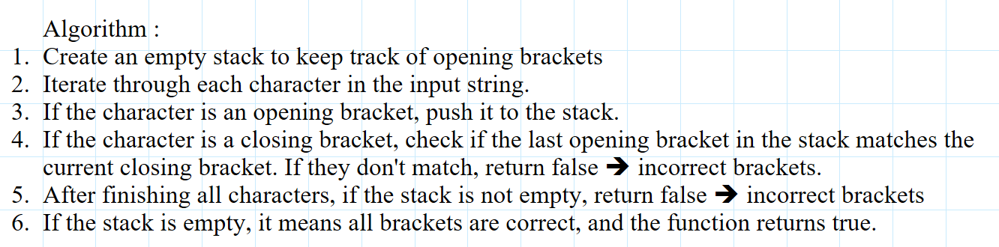

## satck and Queues

### Feature Tasks or problem domain

#### Write a function called validate brackets

- Arguments: string
- Return: boolean
- representing whether or not the brackets in the string are balanced

#### test and eadge cases

  

### algorithm

### code

[javaScript file](./index.js)

### tests

### Efficiency

