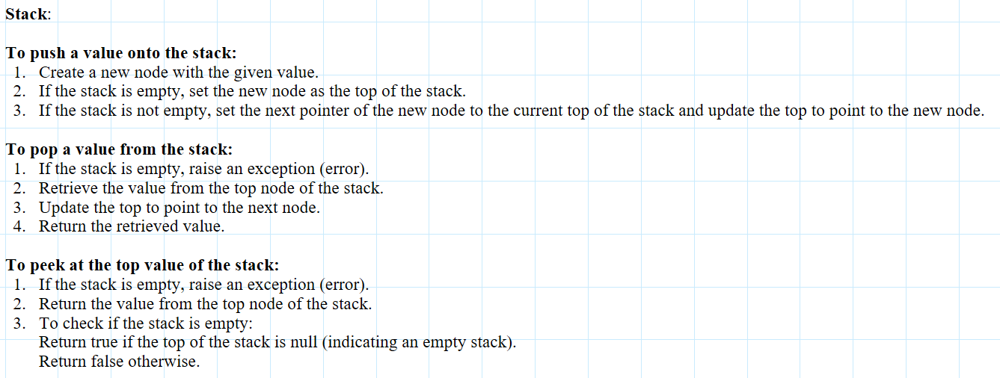
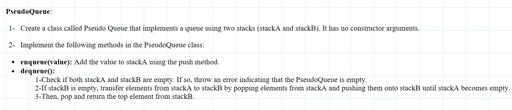
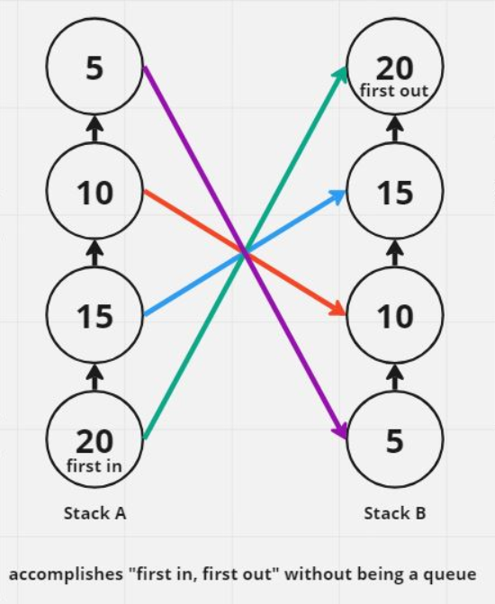
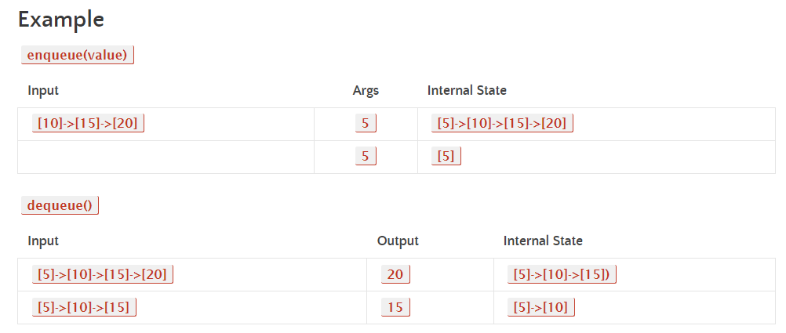
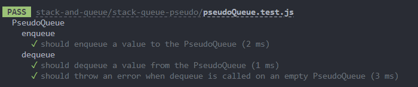
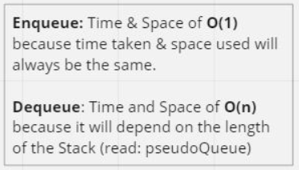

## pseudo queue

### Feature Tasks or problem domain

#### Create a new class called pseudo queue.

- Do not use an existing Queue.
- Instead, this PseudoQueue class will implement our standard queue interface (the two methods listed below),
- Internally, utilize 2 Stack instances to create and manage the queue

#### Methods:

- enqueue 
  Arguments: value 
  Inserts a value into the PseudoQueue, using a first-in, first-out approach.
- dequeue 
  Arguments: none  
  Extracts a value from the PseudoQueue, using a first-in, first-out approach.

### NOTE: The Stack instances have only push, pop, and peek methods. You should use your own Stack implementation. Instantiate these Stack objects in your PseudoQueue constructor.

### algorithm

### visualization

### code

[javaScript file](./queue-pseudo.js)

### tests

### Efficiency

