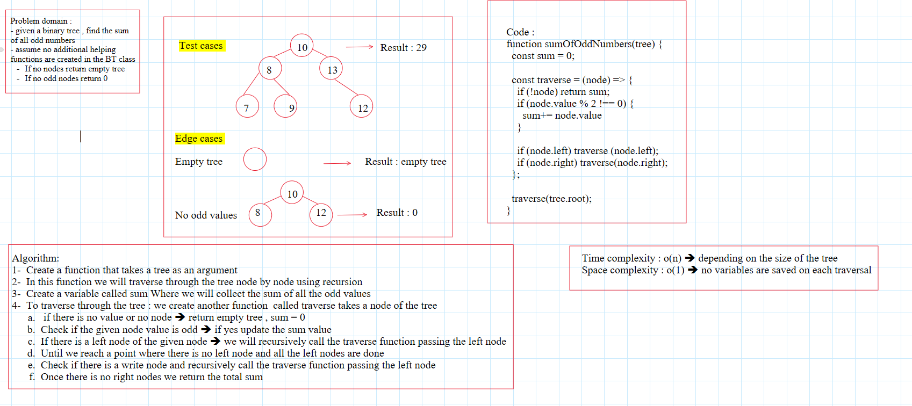

# sum of odd values in a binary tree

### interviewer notes :

- describing the algorithm is not very clear , it's general and it doesn't specify each step in details in terms of descriping the actual code
- to much time on a not so hard problem
- no visualization and code tracking , it was only verbal and not written

### whiteboard

