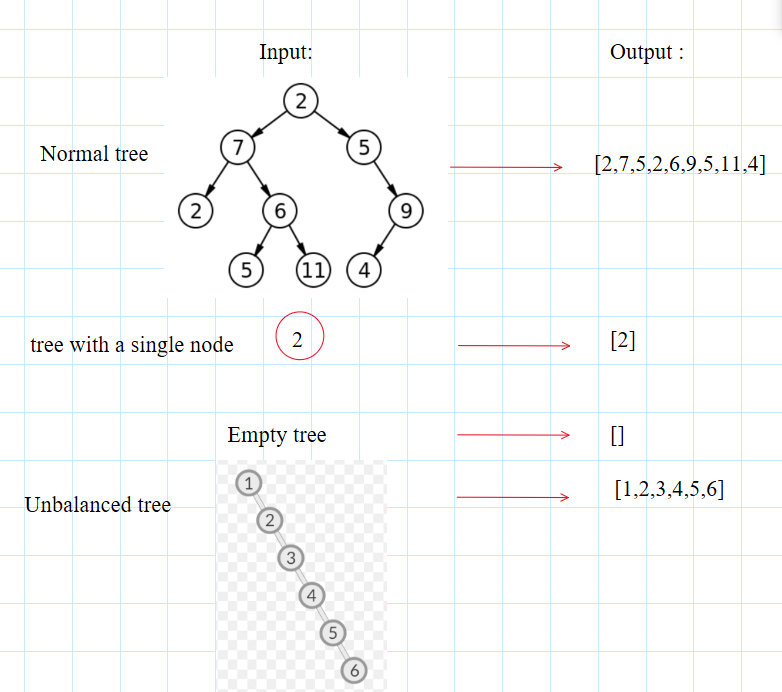
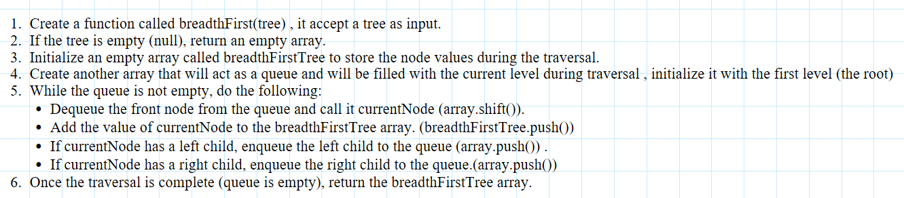
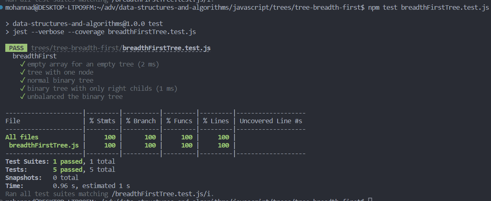

## binary search tree

### Feature Tasks or problem domain

- Write a function called breadth first
- Arguments: tree
- Return: list of all values in the tree, in the order they were encountered
- NOTE: Traverse the input tree using a Breadth-first approach

### test cases and edge cases

### algorithm

### code

[binary tree](./breadthFirstTree.js)

### tests

### Efficiency

