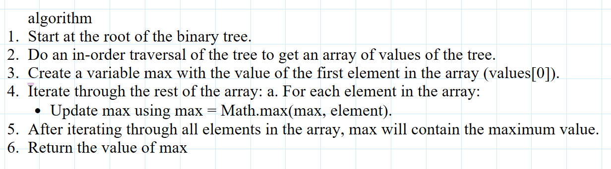
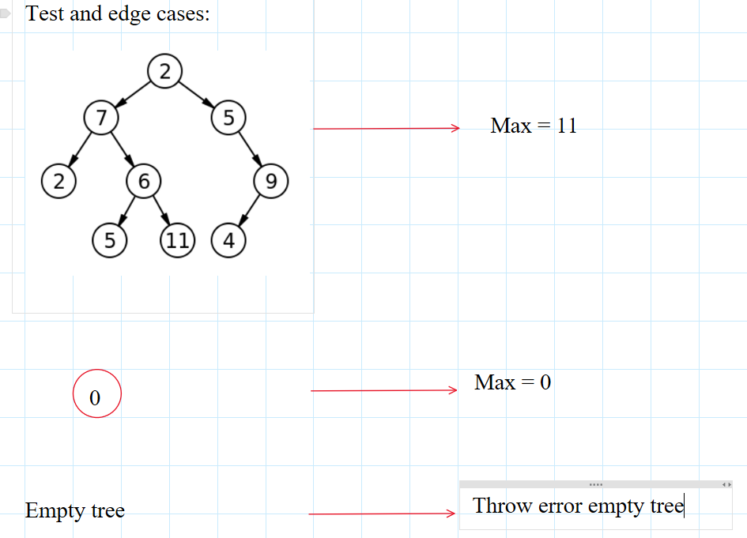
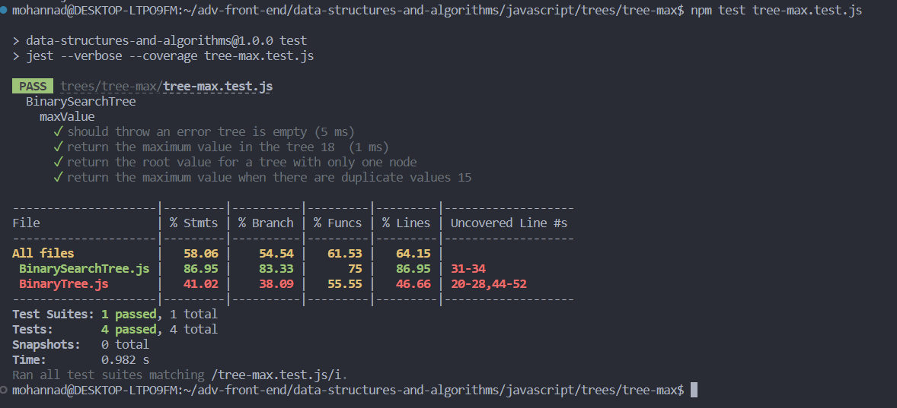
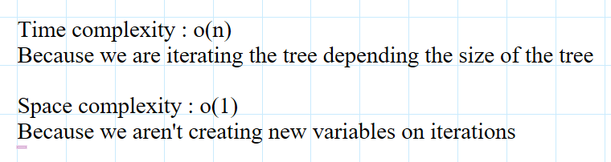

## binary search tree

### Feature Tasks or problem domain

#### Find the Maximum Value in a Binary Tree, Write the following method for the Binary Tree class

find maximum value

- Arguments: none
- Returns: number
  Find the maximum value stored in the tree. You can assume that the values stored in the Binary Tree will be numeric.

### algorithm

#### note that i used the previously created methods to iterate and optain the values , but a better approuch if we are in a binary search tree is to iterate to the right element and you will get the max value automatically

### test cases

### code

[binary search tree](./BinarySearchTree.js)  
[binary tree](./BinaryTree.js)

### tests

### Efficiency

