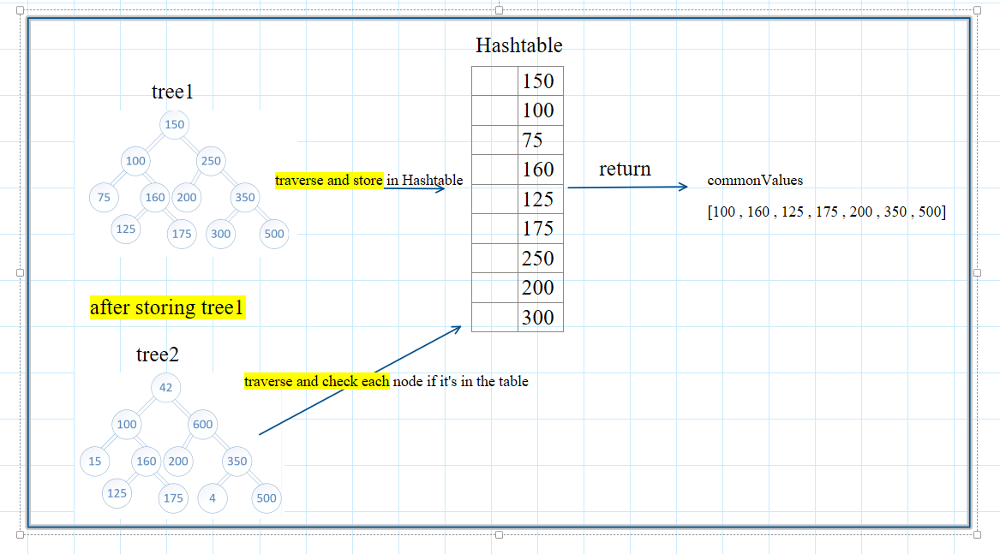

# Hash Table

### Feature Tasks or problem domain

- Write a function called tree_intersection that takes two binary trees as parameters.
- Using your Hashmap implementation as a part of your algorithm, return a set of common values found in both trees.

### test case :

### algorithm

### visualization

### code

[javaScript file](./tree-intersection.js)

### tests

### Efficiency

