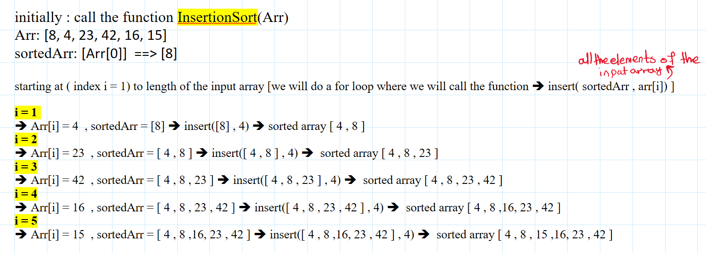
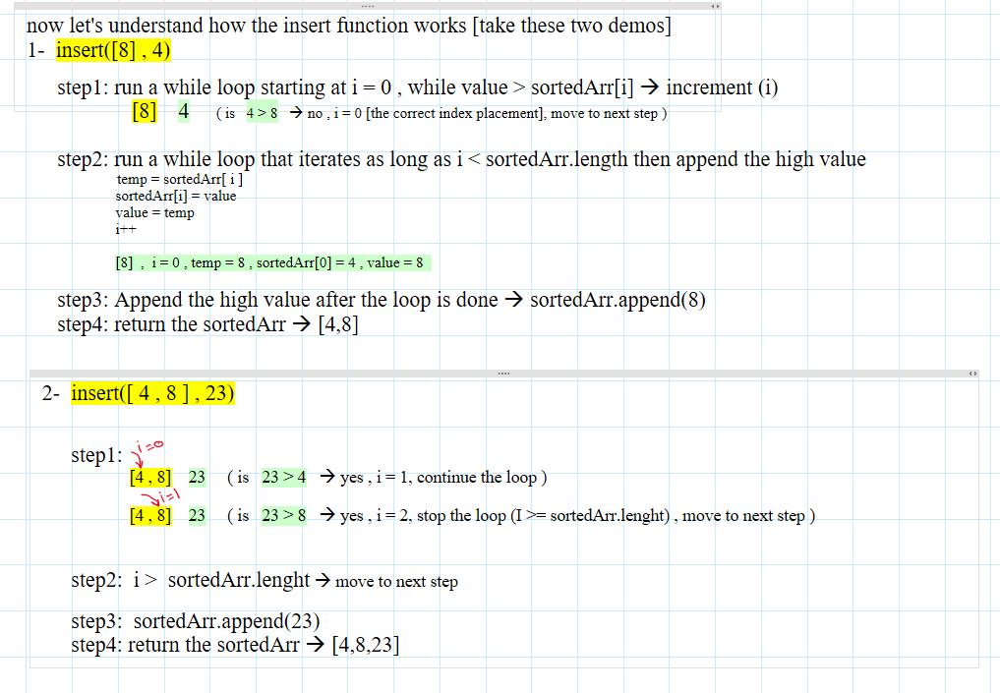
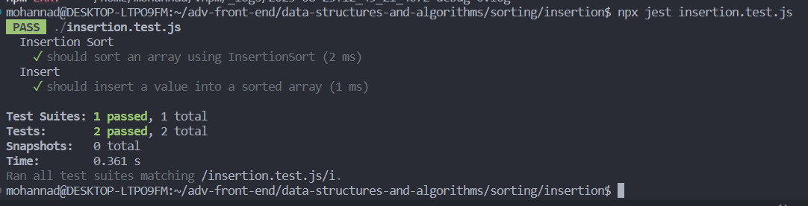
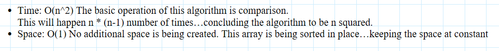

# Blog Notes: Insertion Sort

# Understanding Insertion Sort Algorithm with JavaScript

## Pseudocode Explanation

### The `Insert` Function

This function is responsible for inserting a value into a sorted array while staying sorted: 

1- arguments:

- sorted: The array that is already sorted.
- value: The value to be inserted.
   

2- logic

- The first WHILE loop finds the correct position for the value in the sorted array.
- It continues as long as value is greater than the element at index i in the sorted array.
  Increments i until the correct position is found.
  - The second WHILE loop performs the actual insertion of the value into the sorted array:
  - It starts from the index i (correct position in sorted array)
  - variable temp to store the sorted[i].
  - Replaces the element at index i with the we want to insert.
  - Updates the value with the value stored in temp.
  - Increments i.
  - after the WHILE loop, the value is appended to the sorted array, completing the insertion.

### The `InsertionSort` Function

This function sorts the input array using the insertion sort algorithm. 

1- arguments:

- inputarray: The array that we want to sort.

2- logic:

- The sorted array is initialized to be an array withonly one value ==> the inputarray[0].
- The FOR loop iterates through the input array starting from index 1 (considering we already sorted the index[0]).
- For each element in the input array, the Insert function is called to insert it into the sorted array.
- After iterating through all elements in the input array, the sorted array contains the sorted elements and is returned as the sorted result.

## tracing the code

### the insertion sort function

### the insert function [only the first two steps]

### code

[binary search tree](./insertion.js)  

### tests

### Efficiency

