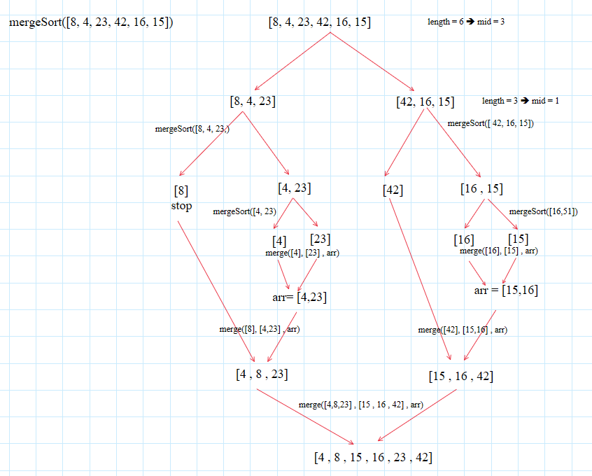
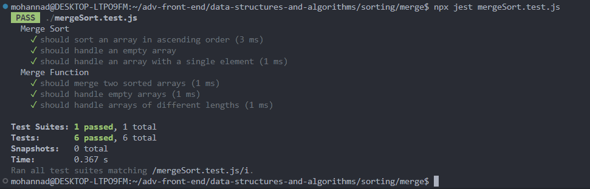
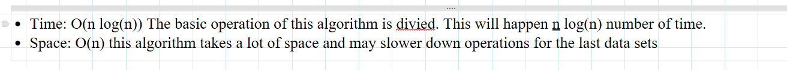

# Blog Notes: Merge Sort

# Understanding Insertion Sort Algorithm with JavaScript

## Pseudocode Explanation

### The `Mergesort(arr)` Function

This function is responsible for initiating the sorting process.: 

1- arguments:

- array: The array that is already sorted.

   

2- logic

- first calculates the length of the array.
  -If length > 1, the algorithm starts the sorting process. If lenght <= 1, the array is already sorted.
  -The array is divided into two halves, left and right, using the midpoint mid (lenght/2).
- The Mergesort function is then called recursively on both the left and right halves.
- Finally, the Merge function is called to merge the sorted left and right halves back into the original arr.

### The `Merge` Function

merging two sorted arrays (left and right) into a single sorted array (arr). 

1- arguments:

- left: left half.
- rigth: right half
- arr

2- logic:

- It has three pointers, i ==> left array, j ==> right array, and k ==> the merged array.
- It iterates through the left and right arrays, comparing elements at i and j, and selects the smaller element to place in the merged array.
- The k pointer is incremented to point to the next position in the merged array.
- After the loop, if there are any remaining elements in either the left or right array, they are copied.

## tracing the code

### the insertion sort function

### code

[INSERTION SORT](./insertion.js)  

### tests

### Efficiency

